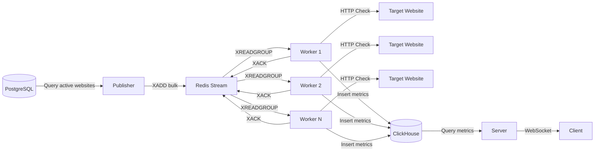
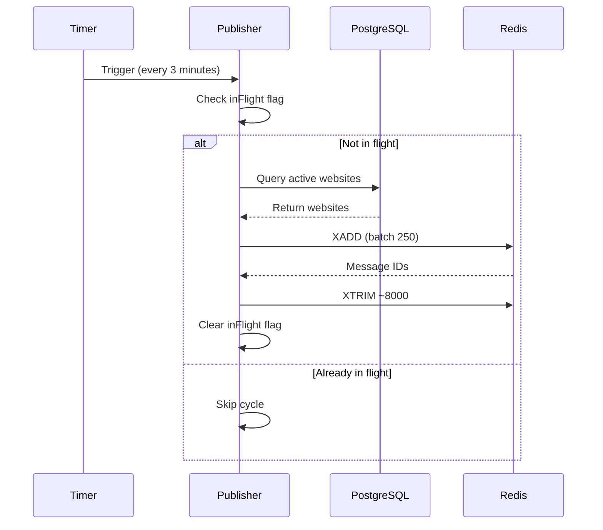
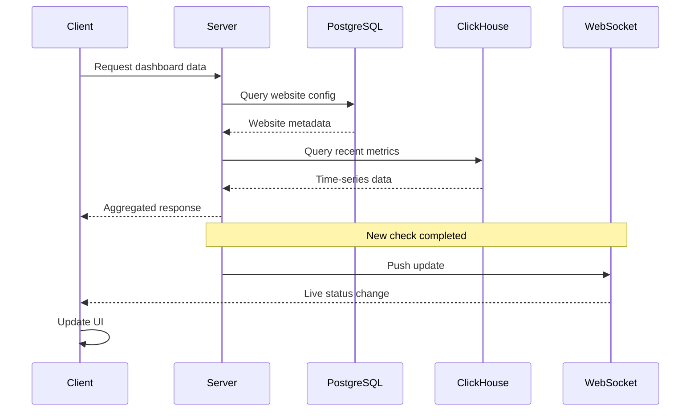

## Overview

Better Uptime implements a distributed, event-driven data pipeline for monitoring website uptime. Data flows through multiple stages: task publishing, distributed processing, metrics storage, and real-time updates.

## Pipeline Stages



## Stage 1: Task Publishing

### Publisher Service

The publisher runs on a fixed interval (3 minutes) and enqueues monitoring tasks.

**Implementation:**

```typescript
async function publish() {
  if (inFlight) {
    return; // Prevent overlapping cycles
  }
  inFlight = true;
  
  try {
    // Fetch active websites from PostgreSQL
    const websites = await prismaClient.website.findMany({
      where: { isActive: true },
      select: { url: true, id: true },
    });

    if (websites.length === 0) {
      console.log('[Publisher] No active websites found');
      return;
    }

    // Bulk publish to Redis Stream
    await xAddBulk(websites.map(w => ({ url: w.url, id: w.id })));
    
    console.log(
      `[Publisher] Successfully published ${websites.length} website(s)`
    );
  } catch (error) {
    console.error('[Publisher] Error during publish cycle:', error);
  } finally {
    inFlight = false;
  }
}

setInterval(publish, 3 * 60 * 1000); // Every 3 minutes
```

**Reference:** `apps/publisher/src/index.ts:6`

### Redis Stream Publishing

**Bulk add operation:**

```typescript
export async function xAddBulk(websites: WebsiteEvent[]) {
  const batchSize = 250;
  
  for (let i = 0; i < websites.length; i += batchSize) {
    const batch = websites.slice(i, i + batchSize);
    
    const multi = client.multi();
    for (const website of batch) {
      multi.xAdd(STREAM_NAME, '*', { url: website.url, id: website.id });
    }
    await multi.exec();
    
    // Trim stream to prevent unbounded growth
    await client.sendCommand(['XTRIM', STREAM_NAME, 'MAXLEN', '~', '8000']);
  }
}
```

**Reference:** `packages/streams/src/index.ts:166`

**Key characteristics:**

- **Batch size**: 250 messages per Redis transaction
- **Stream trimming**: Maintains ~8000 messages maximum
- **Idempotent**: Safe to run multiple times
- **Fast**: Completes in milliseconds for thousands of websites

### Publishing Cycle Diagram



## Stage 2: Distributed Processing

### Worker Consumer Architecture

Workers use Redis consumer groups to distribute load and ensure reliability.

**Consumer group setup:**

```typescript
await ensureConsumerGroup(REGION_ID);

// Consumer group automatically distributes messages
// Each worker gets different messages from the stream
```

### Main Processing Loop

**Worker implementation:**

```typescript
while (true) {
  try {
    // 1. Read fresh messages (blocking, 1 second timeout)
    const fresh = await xReadGroup({
      consumerGroup: REGION_ID,
      workerId: WORKER_ID,
    });

    if (fresh.length > 0) {
      await processMessages(fresh, false);
    }

    // 2. Reclaim stale messages (PEL maintenance)
    const reclaimed = await xAutoClaimStale({
      consumerGroup: REGION_ID,
      workerId: WORKER_ID,
      minIdleMs: 300_000, // 5 minutes
      count: 5,
      maxTotalReclaim: 10,
    });

    if (reclaimed.length > 0) {
      await processMessages(reclaimed, true);
    }

    markLoopAlive(); // Watchdog liveness signal
  } catch (error) {
    console.error('[Worker] Error in main loop:', error);
    await sleep(2000); // Backoff on error
  }
}
```

**Reference:** `apps/worker/src/index.ts:463`

### Message Processing Pipeline

**Single message flow:**

```typescript
async function processMessages(messages, isReclaimed = false) {
  // 1. Validate websites (check if still active)
  const validMessages = [];
  const invalidMessageIds = [];
  
  for (const message of messages) {
    const website = await prismaClient.website.findUnique({
      where: { id: message.event.id },
    });
    
    if (!website || !website.isActive) {
      invalidMessageIds.push(message.id);
      continue;
    }
    
    validMessages.push(message);
  }
  
  // 2. ACK invalid messages immediately
  if (invalidMessageIds.length > 0) {
    await xAckBulk({
      consumerGroup: REGION_ID,
      eventIds: invalidMessageIds,
    });
  }
  
  // 3. Execute HTTP checks in parallel
  const results = await Promise.allSettled(
    validMessages.map(msg => checkWebsite(msg.event.url, msg.event.id))
  );
  
  // 4. Collect successful events
  const eventsToRecord = [];
  for (const [index, message] of validMessages.entries()) {
    const result = results[index];
    if (result?.status === 'fulfilled') {
      eventsToRecord.push(result.value);
    }
  }
  
  // 5. Batch insert to ClickHouse
  try {
    await recordUptimeEvents(eventsToRecord);
    markWriteSuccess(); // Liveness signal
  } catch (error) {
    console.error('Failed to persist batch', error);
    // Continue to ACK (prevent PEL growth)
  }
  
  // 6. ACK all messages
  await xAckBulk({
    consumerGroup: REGION_ID,
    eventIds: validMessages.map(m => m.id),
  });
}
```

**Reference:** `apps/worker/src/index.ts:313`

### HTTP Health Check

**Check implementation:**

```typescript
async function checkWebsite(
  url: string,
  websiteId: string
): Promise<UptimeEventRecord> {
  const startTime = Date.now();
  let status: UptimeStatus = 'DOWN';
  let responseTimeMs: number | undefined;
  let httpStatus: number | undefined;
  const checkedAt = new Date();
  
  const abortController = new AbortController();
  const abortTimeout = setTimeout(
    () => abortController.abort(),
    10_000 // 10 second timeout
  );
  
  try {
    const res = await withTimeout(
      axios.get(url, {
        signal: abortController.signal,
        maxRedirects: 5,
        validateStatus: () => true, // Don't throw on 4xx/5xx
        headers: {
          'User-Agent': 'Uptique/1.0 (Uptime Monitor)'
        },
      }),
      12_000, // Hard timeout
      `Website check ${websiteId}`
    );
    
    responseTimeMs = Date.now() - startTime;
    httpStatus = res.status;
    
    // Consider < 500 as UP
    status = typeof httpStatus === 'number' && httpStatus < 500
      ? 'UP'
      : 'DOWN';
    
    console.log(
      `[Worker] [${websiteId}] ${url} => ` +
      `http=${httpStatus}, ${status}, ${responseTimeMs}ms`
    );
  } catch (error) {
    responseTimeMs = Date.now() - startTime;
    console.log(
      `[Worker] [${websiteId}] ${url} => FAILED (${responseTimeMs}ms)`
    );
  } finally {
    clearTimeout(abortTimeout);
  }
  
  return {
    websiteId,
    regionId: REGION_ID,
    status,
    responseTimeMs,
    httpStatusCode: httpStatus,
    checkedAt,
  };
}
```

**Reference:** `apps/worker/src/index.ts:64`

**Timeout strategy:**

- **Axios timeout**: 10 seconds (via AbortController)
- **Hard timeout**: 12 seconds (via `withTimeout` wrapper)
- **Fallback**: Prevents indefinite hangs

### Reliability Mechanisms

#### Consumer Groups

**Automatic load distribution:**

```typescript
// Multiple workers in the same consumer group
// Each worker gets different messages
const messages = await xReadGroup({
  consumerGroup: 'us-east-1', // Same group
  workerId: 'worker-1',        // Different ID
});
```

**Benefits:**

- Horizontal scaling: Add more workers to process faster
- Fault tolerance: If a worker crashes, messages are reclaimed
- No coordination needed: Redis handles distribution

#### Pending Entries List (PEL)

**Automatic message reclaim:**

```typescript
const reclaimed = await xAutoClaimStale({
  consumerGroup: REGION_ID,
  workerId: WORKER_ID,
  minIdleMs: 300_000, // Reclaim after 5 minutes idle
  count: 5,           // Small batch to prevent starving fresh work
  maxTotalReclaim: 10,
});
```

**When messages become stale:**

1. Worker reads message but crashes before ACK
2. Worker hangs on HTTP request
3. Network partition prevents ACK

**PEL reclaim:**

- Runs every loop iteration (maintenance, not fallback)
- Small batch size prevents starving fresh messages
- Messages reclaimed after 5 minutes idle
- Force-clear messages stuck > 1 hour

#### Worker Watchdog

**Self-liveness monitoring:**

```typescript
let lastLoopIterationAt = Date.now();

setInterval(() => {
  const timeSinceLastLoop = Date.now() - lastLoopIterationAt;
  
  if (timeSinceLastLoop > 300_000) { // 5 minutes
    console.error('Main loop frozen. Forcing process exit.');
    process.exit(1); // PM2 will restart
  }
}, 2 * 60 * 1000); // Check every 2 minutes
```

**Reference:** `apps/worker/src/index.ts:274`

**Recovery:**

- PM2 automatically restarts crashed workers
- Exponential backoff prevents restart storms
- Messages in PEL are reclaimed by other workers

## Stage 3: Metrics Storage

### ClickHouse Insert

**Batch insert operation:**

```typescript
export async function recordUptimeEvents(
  events: UptimeEventRecord[]
): Promise<void> {
  await ensureSchema(); // Verify table exists
  
  if (events.length === 0) return;
  
  const clickhouse = getClient();
  const ingestedAt = toClickHouseDateTime64(new Date());
  
  await clickhouse.insert({
    table: CLICKHOUSE_METRICS_TABLE,
    values: events.map(event => ({
      website_id: event.websiteId,
      region_id: event.regionId,
      status: event.status,
      response_time_ms: event.responseTimeMs ?? null,
      http_status_code: event.httpStatusCode ?? null,
      checked_at: toClickHouseDateTime64(event.checkedAt),
      ingested_at: ingestedAt,
    })),
    format: 'JSONEachRow',
  });
}
```

**Reference:** `packages/clickhouse/src/index.ts:154`

### Schema Design

**Optimized for time-series queries:**

```sql
CREATE TABLE uptime_metrics (
  website_id String,
  region_id String,
  status Enum('UP' = 1, 'DOWN' = 0),
  response_time_ms Nullable(UInt32),
  http_status_code Nullable(UInt16),
  checked_at DateTime64(3, 'UTC'),
  ingested_at DateTime64(3, 'UTC')
)
ENGINE = MergeTree
ORDER BY (website_id, region_id, checked_at)
```

**Order by key benefits:**

- Fast queries filtering by `website_id`
- Efficient range scans on `checked_at`
- Columnar storage compresses well
- Parallel query execution

### Query Patterns

**Recent events (last 90 per website):**

```typescript
const query = `
  SELECT 
    website_id,
    region_id,
    status,
    checked_at,
    response_time_ms,
    http_status_code
  FROM uptime_metrics
  WHERE website_id IN (${escapedIds})
  ORDER BY website_id, checked_at DESC
  LIMIT 90 BY website_id
`;
```

**Historical analysis (last N hours):**

```typescript
const query = `
  SELECT *
  FROM uptime_metrics
  WHERE website_id IN (${escapedIds})
    AND checked_at >= now() - INTERVAL ${hours} HOUR
  ORDER BY website_id, checked_at DESC
`;
```

**Reference:** `packages/clickhouse/src/index.ts:220`

## Stage 4: Real-Time Updates

### WebSocket Subscriptions

The server pushes live updates to connected clients:

```typescript
// Client subscribes to website updates
const subscription = trpc.website.subscribe.useSubscription({
  websiteId: 'abc123',
});

// Server pushes new events
subscription.onData((event) => {
  // Update UI with new status
  updateDashboard(event);
});
```

### Data Aggregation Flow



## Performance Characteristics

### Throughput

**Publisher:**

- Publishes 1000 websites in ~500ms
- Handles 10,000+ active websites easily
- Redis pipeline batching (250 per transaction)

**Worker:**

- Processes 5 checks concurrently
- Each check completes in 100-500ms typically
- Single worker: ~600 checks/minute (10 checks/second)
- 10 workers: ~6,000 checks/minute

**ClickHouse:**

- Ingests 10,000+ rows/second
- Query latency < 100ms for typical dashboards
- Handles billions of rows efficiently

### Latency

**End-to-end (publish to result):**

- Minimum: ~1 second (Redis + HTTP + ClickHouse)
- Typical: ~2-5 seconds
- Maximum: ~30 seconds (timeout + retry)

**Component breakdown:**

- Redis XREADGROUP: < 10ms (in-memory)
- HTTP check: 100-1000ms (network dependent)
- ClickHouse insert: 10-50ms (batch)
- Message ACK: < 10ms

## Failure Modes & Recovery

### Publisher Failure

**Symptom:** No new tasks in Redis Stream

**Detection:** Monitor stream length

**Recovery:**

- Publisher restarts automatically (PM2)
- Next cycle publishes all active websites
- No data loss (websites re-enqueued)

### Worker Failure

**Symptom:** Messages stuck in PEL

**Detection:** PEL monitoring (every 5 minutes)

**Recovery:**

- Other workers reclaim stale messages (5 min idle)
- Force-clear messages stuck > 1 hour
- Worker restarts and rejoins consumer group

### Redis Failure

**Symptom:** Connection errors

**Detection:** Client-side timeouts

**Recovery:**

- Exponential backoff reconnection
- Operations queue until reconnect
- PEL persists through Redis restart

### ClickHouse Failure

**Symptom:** Insert timeouts

**Detection:** Insert operation fails

**Recovery:**

- Messages still ACKed (prevent PEL growth)
- Failed checks retried on next publish cycle
- No permanent data loss (idempotent checks)

### PostgreSQL Failure

**Symptom:** Website validation fails

**Detection:** Prisma query timeout

**Recovery:**

- Treat as invalid website (ACK message)
- Re-enqueued on next publish cycle
- Connection pool reconnects automatically

## Next Steps

<CardGroup cols={2}>
  <Card title="System Architecture" icon="diagram-project" href="/architecture/overview">
    Review the high-level architecture
  </Card>
  <Card title="Technology Stack" icon="layer-group" href="/architecture/tech-stack">
    Learn about the technologies used
  </Card>
  <Card title="Monorepo Structure" icon="folder-tree" href="/architecture/monorepo-structure">
    Explore the codebase organization
  </Card>
</CardGroup>