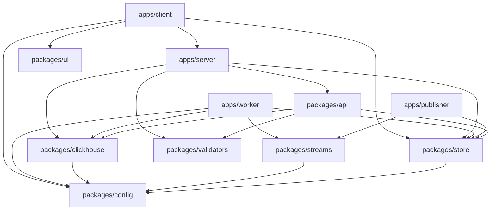

## Overview

Better Uptime uses **Turborepo** to manage a monorepo containing multiple applications and shared packages. This structure enables code sharing, consistent tooling, and efficient builds.

## Repository Layout

```
my-turborepo/
├── apps/
│   ├── client/          # Next.js frontend
│   ├── server/          # tRPC API server
│   ├── worker/          # Uptime check worker
│   └── publisher/       # Task publishing service
├── packages/
│   ├── api/             # tRPC router definitions
│   ├── store/           # Prisma client & database
│   ├── clickhouse/      # ClickHouse client
│   ├── streams/         # Redis Streams client
│   ├── validators/      # Zod schemas
│   ├── config/          # Shared configuration
│   └── ui/              # Shared UI components
├── tooling/
│   ├── eslint-config/   # Shared ESLint config
│   └── typescript-config/ # Shared TypeScript config
├── turbo.json           # Turborepo configuration
└── package.json         # Workspace root
```

## Applications

### Client (`apps/client`)

**Next.js web application**

The user-facing dashboard for monitoring websites and managing configurations.

**Key features:**
- Server-side rendering
- tRPC client integration
- Real-time WebSocket updates
- Responsive design with Tailwind CSS

**Dependencies:**
- `@repo/config`: Environment variables
- `@repo/store`: Database access
- `server`: Type definitions for tRPC

**Scripts:**
```bash
pnpm dev        # Development server
pnpm build      # Production build
pnpm start      # Start production server
```

### Server (`apps/server`)

**tRPC API server**

Central API layer exposing type-safe endpoints for the client.

**Responsibilities:**
- User authentication
- Website CRUD operations
- Status page management
- Real-time subscriptions
- Query orchestration across databases

**Router structure:**
```typescript
const appRouter = router({
  user: userRouter,
  website: websiteRouter,
  statusPage: statusPageRouter,
  statusDomain: statusDomainRouter,
});
```

**Dependencies:**
- `@repo/api`: Router implementations
- `@repo/store`: PostgreSQL access
- `@repo/clickhouse`: Time-series queries
- `@repo/validators`: Request validation

**Reference:** `apps/server/src/index.ts:9`

### Worker (`apps/worker`)

**Uptime check worker**

Consumes website check tasks from Redis and executes HTTP health checks.

**Responsibilities:**
- Consume tasks from Redis Stream consumer group
- Execute HTTP requests to monitored websites
- Record metrics to ClickHouse
- Handle message acknowledgment and PEL management
- Self-monitoring and auto-recovery

**Architecture highlights:**
- Consumer group support for horizontal scaling
- Automatic stale message reclaim
- Worker watchdog for freeze detection
- Timeout protection on all operations

**Dependencies:**
- `@repo/clickhouse`: Metrics storage
- `@repo/streams`: Redis Stream consumer
- `@repo/store`: Website validation
- `@repo/config`: Environment configuration

**Reference:** `apps/worker/src/index.ts:123`

### Publisher (`apps/publisher`)

**Task publishing service**

Periodically queries active websites and publishes check tasks to Redis.

**Responsibilities:**
- Query PostgreSQL for active websites (every 3 minutes)
- Bulk publish to Redis Stream
- Prevent overlapping publish cycles
- Trim stream to prevent memory exhaustion

**Key implementation details:**
```typescript
// Publish cycle
const websites = await prismaClient.website.findMany({
  where: { isActive: true },
  select: { url: true, id: true },
});

await xAddBulk(websites.map(w => ({ url: w.url, id: w.id })));
```

**Dependencies:**
- `@repo/store`: Website queries
- `@repo/streams`: Redis Stream publisher

**Reference:** `apps/publisher/src/index.ts:6`

## Shared Packages

### API (`packages/api`)

**tRPC router definitions**

Centralized API logic shared between server and client.

**Exports:**
- `userRouter`: Authentication and user management
- `websiteRouter`: Website monitoring CRUD
- `statusPageRouter`: Public status pages
- `statusDomainRouter`: Custom domain configuration

**Benefits:**
- Single source of truth for API logic
- Type definitions flow to client automatically
- Easy to test in isolation

### Store (`packages/store`)

**Prisma client and database access**

**Responsibilities:**
- Database schema (Prisma schema)
- Type-safe query client
- Database migrations

**Usage:**
```typescript
import { prismaClient } from '@repo/store';

const website = await prismaClient.website.findUnique({
  where: { id: websiteId }
});
```

### ClickHouse (`packages/clickhouse`)

**Time-series metrics storage**

**Responsibilities:**
- ClickHouse client initialization
- Schema management
- Batch insert operations
- Query helpers for metrics retrieval

**Key functions:**
- `recordUptimeEvents(events)`: Batch insert metrics
- `getRecentStatusEvents(websiteIds, limit)`: Query recent checks
- `getStatusEventsForLookbackHours(websiteIds, hours)`: Historical data

**Reference:** `packages/clickhouse/src/index.ts:154`

### Streams (`packages/streams`)

**Redis Streams abstraction**

**Responsibilities:**
- Redis client configuration
- Stream publishing (XADD)
- Consumer group management (XREADGROUP)
- Automatic message acknowledgment (XACK)
- PEL monitoring and reclaim (XAUTOCLAIM)

**Key functions:**
- `xAddBulk(websites)`: Publish batch of tasks
- `xReadGroup(options)`: Consume tasks
- `xAckBulk(options)`: Acknowledge processed tasks
- `xAutoClaimStale(options)`: Reclaim stale messages
- `xPendingInfo(consumerGroup)`: Monitor PEL health

**Reference:** `packages/streams/src/index.ts:206`

### Validators (`packages/validators`)

**Zod schemas for runtime validation**

**Exports:**
- Input validators for tRPC mutations
- Response validators for API contracts
- Shared type definitions

**Benefits:**
- Single source of truth for validation logic
- Automatic TypeScript type inference
- Reusable across server and client

### Config (`packages/config`)

**Environment variables and configuration**

**Responsibilities:**
- Centralized environment variable access
- Type-safe configuration
- Default values and validation

**Usage:**
```typescript
import { REGION_ID, WORKER_ID } from '@repo/config';
```

**Reference:** `apps/worker/src/index.ts:6`

### UI (`packages/ui`)

**Shared React components**

**Responsibilities:**
- Reusable UI components
- Common hooks and utilities
- Design system primitives

**Benefits:**
- Consistent UI across applications
- Single place to update shared components
- Easier to maintain design system

## Tooling Packages

### ESLint Config (`tooling/eslint-config`)

**Shared ESLint configuration**

- Base rules for TypeScript
- React-specific rules
- Next.js-specific rules
- Consistent across all packages

### TypeScript Config (`tooling/typescript-config`)

**Shared TypeScript configuration**

- Base `tsconfig.json`
- Strict type checking
- Module resolution settings
- Extended by individual packages

## Turborepo Configuration

### Build Pipeline

**`turbo.json` defines the build pipeline:**

```json
{
  "tasks": {
    "build": {
      "dependsOn": ["^build"],
      "inputs": ["$TURBO_DEFAULT$", ".env*"],
      "outputs": [".next/**", "!.next/cache/**"]
    },
    "dev": {
      "cache": false,
      "persistent": true
    },
    "test": {
      "dependsOn": ["^build"],
      "cache": false
    }
  }
}
```

**Reference:** `turbo.json`

### Task Dependencies

**`^build` notation:**
- Turbo builds all dependencies first
- Example: `server` depends on `@repo/api`, so `api` builds first

**Parallel execution:**
- Independent tasks run concurrently
- Dramatically faster than sequential builds

### Caching Strategy

**Cached tasks:**
- `build`: Cached based on inputs and dependencies
- `lint`: Cached for unchanged files
- `test:coverage`: Cached with coverage outputs

**Non-cached tasks:**
- `dev`: Always runs (persistent)
- `test`: Live runs ensure fresh results

## Workspace Dependencies

### Internal Dependencies

**Using workspace protocol:**
```json
{
  "dependencies": {
    "@repo/config": "workspace:*",
    "@repo/store": "workspace:^"
  }
}
```

- `workspace:*`: Any version in workspace
- `workspace:^`: Compatible version in workspace

### Dependency Graph



## Package Manager

**pnpm (version 9.0.0)**

**Benefits:**
- Efficient disk space usage (content-addressable storage)
- Faster than npm and Yarn
- Strict dependency resolution
- Native workspace support

**Commands:**
```bash
pnpm install              # Install all dependencies
pnpm build                # Build all packages
pnpm dev                  # Run dev servers
pnpm test                 # Run all tests
pnpm --filter client dev  # Run specific package
```

## Development Workflow

### Starting Development

```bash
# Install dependencies
pnpm install

# Build all packages
pnpm build

# Start all dev servers
pnpm dev
```

### Adding a New Package

```bash
# Create package directory
mkdir packages/new-package
cd packages/new-package

# Initialize package.json
pnpm init

# Add to workspace (automatic with pnpm)
```

### Using a Workspace Package

```bash
# Add dependency to another package
cd apps/client
pnpm add @repo/new-package --workspace
```

## Benefits of This Structure

### Code Sharing

- Shared logic in packages, not duplicated
- Type definitions shared automatically
- Utilities accessible everywhere

### Independent Deployment

- Each app can be deployed separately
- Worker can scale independently of server
- Publisher runs as isolated service

### Build Efficiency

- Only rebuild changed packages
- Parallel builds across CPU cores
- Shared build cache

### Type Safety

- TypeScript types flow through dependencies
- Changes in packages detected at build time
- Refactoring is safer

### Testing

- Test packages in isolation
- Shared test utilities
- Fast feedback loop

## Next Steps

<CardGroup cols={2}>
  <Card title="System Architecture" icon="diagram-project" href="/architecture/overview">
    Understand component interactions
  </Card>
  <Card title="Data Flow" icon="arrow-right-arrow-left" href="/architecture/data-flow">
    Learn how data moves through the system
  </Card>
</CardGroup>