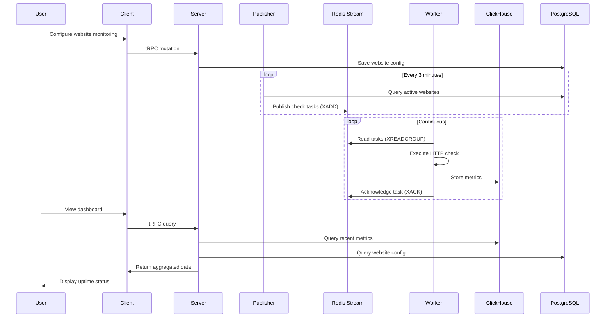

## Overview

Better Uptime is a modern uptime monitoring platform built for performance, reliability, and scale. The system follows a distributed, event-driven architecture with clear separation of concerns across multiple services.

## Architecture Diagram

<Frame>
  
</Frame>

<Info>
  View the full, interactive architecture diagram on [Excalidraw](https://excalidraw.com/#json=10MK6ZkcCFbxAVLMBwLKa,jWBUnZGQSGjJJ1fYNKfwVA)
</Info>

## Core Components

### Client (Frontend)

The Next.js-based web application provides the user interface for:
- Managing monitored websites
- Viewing real-time uptime status
- Analyzing historical metrics and trends
- Configuring status pages

**Key characteristics:**
- Server-side rendering for optimal performance
- tRPC client for type-safe API communication
- Real-time updates via WebSocket connections
- Responsive UI built with React and Tailwind CSS

### Server (API Layer)

The tRPC server acts as the central API gateway:
- Exposes type-safe RPC endpoints
- Handles authentication and authorization
- Manages WebSocket connections for real-time updates
- Orchestrates data access across PostgreSQL, ClickHouse, and Redis

**Routers:**
- `userRouter` - User authentication and profile management
- `websiteRouter` - Website monitoring configuration
- `statusPageRouter` - Public status page management
- `statusDomainRouter` - Custom domain configuration

### Publisher

The publisher service continuously enqueues monitoring tasks:
- Queries PostgreSQL for active websites (every 3 minutes)
- Publishes website check tasks to Redis Streams
- Ensures only active websites are monitored
- Implements in-flight protection to prevent overlapping cycles

**Reference:** `apps/publisher/src/index.ts:6`

### Worker

Worker instances perform the actual uptime checks:
- Consume website check tasks from Redis Streams
- Execute HTTP requests to monitored URLs
- Record metrics (response time, status code, availability)
- Write results to ClickHouse for long-term storage
- Implement graceful error handling and PEL (Pending Entries List) management

**Key features:**
- Consumer group support for horizontal scaling
- Automatic reclaim of stale messages
- Self-liveness monitoring and auto-recovery
- Timeout protection on all external operations

**Reference:** `apps/worker/src/index.ts:123`

## Component Interactions

## Data Flow

The system processes monitoring data through three distinct phases:

### 1. Task Publishing

The publisher service maintains a continuous publishing cycle:

1. Query PostgreSQL for all active websites
2. Bulk publish to Redis Stream using `XADD`
3. Trim stream to prevent unbounded growth (~8000 messages max)
4. Wait for next interval (3 minutes)

### 2. Task Processing

Worker instances consume and process tasks:

1. **Fresh messages**: Read new tasks with `XREADGROUP` (blocking, 1 second)
2. **Validation**: Check if website is still active via Prisma
3. **HTTP check**: Execute request with configurable timeout (10 seconds)
4. **Metrics recording**: Batch insert to ClickHouse
5. **Acknowledgment**: Remove from Redis PEL with `XACK`
6. **PEL reclaim**: Automatically reclaim stale messages (idle > 5 minutes)

### 3. Data Retrieval

The server aggregates data from multiple sources:

1. **Configuration data**: PostgreSQL (website settings, user data)
2. **Metrics data**: ClickHouse (time-series uptime events)
3. **Real-time status**: Redis (current processing state)
4. **WebSocket push**: Live updates to connected clients

## Scalability

### Horizontal Scaling

- **Worker instances**: Multiple workers can join the same Redis consumer group
- **Region support**: Workers can be deployed across different geographic regions
- **Independent scaling**: Each component (client, server, worker, publisher) scales independently

### Data Partitioning

- **ClickHouse**: Ordered by `(website_id, region_id, checked_at)` for efficient queries
- **Redis Streams**: Consumer groups distribute work across workers
- **PostgreSQL**: Indexed for fast website lookups and user queries

## Reliability

### Fault Tolerance

- **Redis reconnection**: Automatic exponential backoff with jitter
- **PEL management**: Stale messages are automatically reclaimed
- **Worker watchdog**: Self-monitoring with automatic restart on freeze
- **Timeout protection**: All external operations have client-side timeouts

### Data Consistency

- **At-least-once delivery**: Redis Streams with consumer groups
- **Idempotent processing**: Safe to process the same check multiple times
- **ACK safety**: Messages are ACKed even on processing failures to prevent PEL growth
- **Publisher re-enqueue**: Failed checks are retried on the next publishing cycle

## Next Steps

<CardGroup cols={2}>
  <Card title="Technology Stack" icon="layer-group" href="/architecture/tech-stack">
    Explore the technologies powering Better Uptime
  </Card>
  <Card title="Monorepo Structure" icon="folder-tree" href="/architecture/monorepo-structure">
    Understand the codebase organization
  </Card>
  <Card title="Data Flow" icon="arrow-right-arrow-left" href="/architecture/data-flow">
    Deep dive into the data pipeline
  </Card>
</CardGroup>